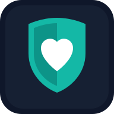

# SafeSpace Salone

An anonymous, low-bandwidth mental health therapy platform designed for Sierra Leone.



## Overview

Unlike Western apps that rely on expensive live video, SafeSpace Salone uses **asynchronous voice notes and text** (similar to WhatsApp) to connect users with verified counselors. It prioritizes data privacy and functions seamlessly on 3G networks.

**Built for the Hackathon** - This is a prototype demonstrating the concept of accessible mental health support for Sierra Leone.

## Features

### For Patients
- **Anonymous Sign-up**: Create accounts with fun avatars - no real names required
- **Topic Selection**: Choose from categories like Trauma, Anxiety, Addiction, and more
- **Urgency Levels**: Indicate how urgently you need support
- **Voice Notes**: Record and send voice messages for more personal communication
- **Text Messaging**: Simple text-based chat when voice isn't preferred
- **Offline Support**: Queue messages when offline, auto-send when back online

### For Counselors
- **Secure Dashboard**: View waiting and active conversations
- **Session Notes**: Private notes for each conversation (stored locally)
- **Patient Context**: See topic, urgency level, and conversation history
- **Real-time Updates**: Polling for new conversations

### Technical
- **PWA**: Installable as a mobile app with offline support
- **Low-Bandwidth**: Optimized for 3G networks
- **Dark Theme**: Calming, eye-friendly interface
- **Accessible**: Focus states, reduced motion support, screen reader friendly

## Tech Stack

| Category | Technology |
|----------|------------|
| Framework | Next.js 14+ (App Router) |
| Language | TypeScript |
| Styling | Tailwind CSS v4 |
| Database | Supabase (PostgreSQL) |
| Realtime | Supabase Realtime |
| Storage | Supabase Storage (voice notes) |
| Icons | Lucide React |
| PWA | @ducanh2912/next-pwa |
| UI Components | Custom + shadcn/ui inspired |

## Getting Started

### Prerequisites
- Node.js 18+
- npm or yarn
- Supabase account

### Installation

1. **Clone the repository**
   ```bash
   git clone https://github.com/your-username/safespace-salone.git
   cd safespace-salone
   ```

2. **Install dependencies**
   ```bash
   npm install
   ```

3. **Set up environment variables**

   Create a `.env.local` file:
   ```env
   NEXT_PUBLIC_SUPABASE_URL=your-supabase-project-url
   NEXT_PUBLIC_SUPABASE_ANON_KEY=your-supabase-anon-key
   ```

4. **Set up the database**

   Run these SQL files in your Supabase SQL Editor:
   ```
   database/schema.sql   # Creates tables and functions
   database/seed.sql     # Adds demo data (optional)
   ```

5. **Generate PWA icons** (optional, already included)
   ```bash
   node scripts/generate-icons.js
   ```

6. **Run the development server**
   ```bash
   npm run dev
   ```

7. **Open the app**

   Visit [http://localhost:3000](http://localhost:3000)

## Demo Credentials

### Test Counselors
After running `seed.sql`, you can log in as:

| Name | PIN |
|------|-----|
| Dr. Hope | 1234 |
| Dr. Grace | 5678 |

**Counselor Login**: `/counselor/login`

### Test Patients
Create a new patient account at `/signup` - no credentials needed, just pick an avatar and PIN!

## Project Structure

```
safespace-salone/
├── database/
│   ├── schema.sql          # Database schema
│   └── seed.sql            # Demo data
├── public/
│   ├── icons/              # PWA icons
│   ├── manifest.json       # PWA manifest
│   └── favicon.svg         # Favicon
├── scripts/
│   └── generate-icons.js   # Icon generation script
├── src/
│   ├── app/                # Next.js App Router pages
│   │   ├── api/            # API routes
│   │   ├── chat/           # Patient chat
│   │   ├── counselor/      # Counselor dashboard & chat
│   │   ├── signup/         # Patient signup
│   │   └── topics/         # Topic selection
│   ├── components/         # React components
│   │   ├── chat/           # Chat-related components
│   │   ├── counselor/      # Counselor-specific components
│   │   └── ui/             # Reusable UI components
│   ├── hooks/              # Custom React hooks
│   ├── lib/                # Utilities and Supabase client
│   └── types/              # TypeScript type definitions
└── ...
```

## Screenshots

*Coming soon - Screenshots of the app in action*

| Patient Flow | Counselor Flow |
|--------------|----------------|
| Signup | Dashboard |
| Topic Selection | Chat View |
| Chat Interface | Session Notes |

## Key Pages

| Route | Description |
|-------|-------------|
| `/` | Landing page |
| `/signup` | Patient anonymous signup |
| `/topics` | Topic and urgency selection |
| `/chat/[id]` | Patient chat interface |
| `/counselor/login` | Counselor login |
| `/counselor/dashboard` | Counselor conversation list |
| `/counselor/chat/[id]` | Counselor chat interface |

## API Routes

| Endpoint | Method | Description |
|----------|--------|-------------|
| `/api/auth/signup` | POST | Create patient account |
| `/api/auth/counselor-login` | POST | Counselor authentication |
| `/api/conversations` | GET/POST | List/create conversations |
| `/api/conversations/[id]` | GET | Get conversation details |
| `/api/messages` | GET/POST | List/send messages |
| `/api/counselor/conversations` | GET/POST | Counselor conversation management |
| `/api/users/[id]` | GET | Get user info |

## Development

### Type Checking
```bash
npx tsc --noEmit
```

### Linting
```bash
npm run lint
```

### Build for Production
```bash
npm run build
```

## Deployment

The app is designed to be deployed on Vercel:

1. Push to GitHub
2. Connect repository to Vercel
3. Add environment variables in Vercel dashboard
4. Deploy!

For other platforms, ensure you have Node.js 18+ and set the environment variables.

## Security Considerations

⚠️ **Hackathon Prototype Notice**

This is a prototype built for demonstration. For production use:

- [ ] Enable Supabase Row Level Security (RLS)
- [ ] Implement proper password hashing (bcrypt)
- [ ] Add rate limiting to API routes
- [ ] Implement proper session management
- [ ] Add end-to-end encryption for messages
- [ ] Conduct security audit
- [ ] Add HIPAA/data protection compliance

## Contributing

Contributions are welcome! Please feel free to submit a Pull Request.

## License

MIT License - See [LICENSE](LICENSE) for details.

## Acknowledgments

- Built with love for Sierra Leone
- Inspired by the need for accessible mental health support
- Thanks to all the counselors and mental health professionals who make a difference

---

**SafeSpace Salone** - *Because everyone deserves a safe space to heal.*
